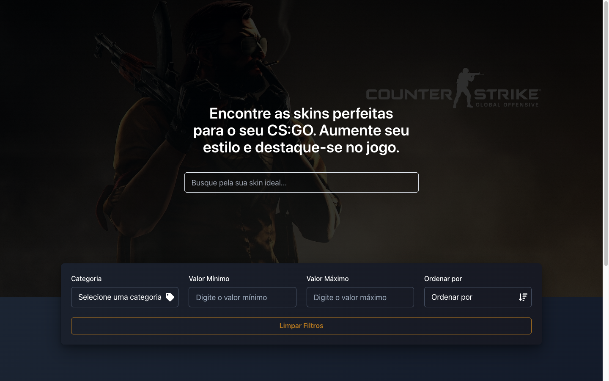

# Skin Store - Frontend & Backend

Este repositório contém a solução completa para uma loja de skins de CS:GO. O projeto foi dividido em duas partes: Frontend e Backend, desenvolvidos com **Next.js** (Frontend) e **NestJS** (Backend).

## Tecnologias

### Frontend:

- **Next.js** - Framework React para renderização do lado do servidor e geração de sites estáticos.
- **TypeScript** - Para tipagem estática.
- **Tailwind CSS** - Estilização baseada em utilitários.
- **React Query** - Gerenciamento de estado do servidor.
- **Chakra UI** - Biblioteca de componentes.

## Comece por aqui

Para iniciar o Frontend:

- **npm install**
- **npm run dev**

O Frontend estará rodando em [http://localhost:3000](http://localhost:3000).

### Backend:

- **NestJs** - Ambiente de execução JavaScript para o servidor.
- **Postgres** - Banco de dados SQL para armazenamento de dados.

## Comece por aqui

Para configurar e iniciar o Backend:

- **npm install**
- **docker compose up -d**
- **npx prisma generate**
- **npm run prisma:seed**
- **npm run start:dev** ou **npm run start:prod**

O Backend estará rodando em [http://localhost:8000](http://localhost:8000).

## Demonstração
https://github.com/user-attachments/assets/a3ddf184-dbee-4087-b646-42e92ae37ddc

# Feito com 💜.
